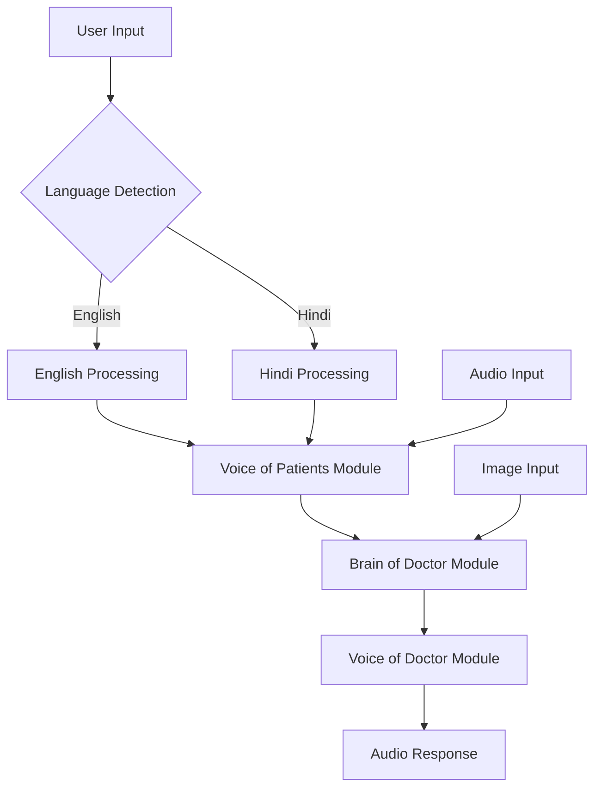

# AI Doctor Chatbot with Voice and Vision

An advanced AI-powered doctor chatbot that combines voice recognition, image analysis, and text-to-speech capabilities to provide medical consultations through natural conversation and visual analysis. Now supports bilingual (Hindi/English) input and output with automatic language detection.

## Features

- **Voice Input**: Record and transcribe user questions using speech recognition
- **Image Analysis**: Upload and analyze medical images using AI vision models
- **Medical Consultation**: AI-powered medical advice based on user input and images
- **Voice Output**: Text-to-speech conversion for natural audio responses
- **Web Interface**: Gradio-based UI for easy interaction
- **Bilingual Support**: Automatic language detection and response in Hindi or English based on user input

## Architecture

The application follows a modular architecture with the following components:

1. **Voice of the Patients** (`voice_of_the_patients.py`): Handles audio recording and speech-to-text conversion with bilingual (Hindi/English) support using Groq's Whisper API
2. **Brain of the Doctor** (`Brain_of_the_doctor.py`): Processes medical queries and image analysis using vision models
3. **Voice of the Doctor** (`voice_of_the_doctor.py`): Converts text responses to speech using ElevenLabs TTS with multilingual support
4. **Gradio Interface** (`gradio_app.py`): Web-based user interface that integrates all components

### Architecture Diagram



The system automatically detects the input language and processes the request accordingly, ensuring responses are generated in the same language as the input.

## Technologies Used

- **Python**: Core programming language
- **Groq API**: For fast AI inference (LLM and Whisper for STT)
- **ElevenLabs API**: For high-quality text-to-speech
- **Gradio**: For the web interface
- **SpeechRecognition**: For speech-to-text processing
- **PyAudio**: For audio input/output
- **Pipenv**: For dependency management
- **dotenv**: For environment variable management

## Prerequisites

- Python 3.8+
- PortAudio (for audio processing)
- FFmpeg (for audio processing)

## Installation

1. Clone the repository:
   ```bash
   git clone https://github.com/YuvrajSinghBhadoria2/AI-doctor_chatbot-voice-agent-.git
   cd AI-doctor_chatbot-voice-agent-
   ```

2. Install system dependencies:
   ```bash
   # On macOS
   brew install portaudio ffmpeg
   
   # On Ubuntu/Debian
   sudo apt-get install portaudio19-dev ffmpeg
   
   # On Windows (using Chocolatey)
   choco install ffmpeg portaudio
   ```

3. Install Python dependencies:
   ```bash
   pip install pipenv
   pipenv install
   ```

4. Install required Python packages:
   ```bash
   pipenv install python-dotenv speechrecognition pyaudio pydub groq elevenlabs gtts gradio
   ```

## Configuration

Create a `.env` file in the project root with the following environment variables:

```env
GROQ_API_KEY=your_groq_api_key_here
ELEVENLABS_API_KEY=your_elevenlabs_api_key_here
```

Get your API keys from:
- Groq: https://console.groq.com/
- ElevenLabs: https://elevenlabs.io/

## Usage

### Running the Application

1. Activate the virtual environment:
   ```bash
   pipenv shell
   ```

2. Start the Gradio interface:
   ```bash
   pipenv run python gradio_app.py
   ```

3. Open your browser and navigate to `http://127.0.0.1:7861`

### Manual Testing

You can also test individual components:

- Test voice recording: `pipenv run python voice_of_the_patients.py`
- Test text-to-speech: `pipenv run python voice_of_the_doctor.py`
- Test image analysis: `pipenv run python Brain_of_the_doctor.py`

## How It Works

1. **Voice Input**: User speaks into the microphone, audio is recorded and transcribed
2. **Image Upload**: User uploads a medical image for analysis
3. **Query Processing**: The transcribed text and image are combined into a medical query
4. **AI Analysis**: The query is sent to the AI model for medical analysis
5. **Response Generation**: AI generates a medical response based on the input
6. **Voice Output**: Response is converted to speech and played back to the user

## API Models Used

- **Vision Model**: `llama-3.2-11b-vision-preview` (for image analysis)
- **STT Model**: `whisper-large-v3` (for speech-to-text)
- **TTS Model**: ElevenLabs voice models (for text-to-speech)
- **Language Model**: `meta-llama/llama-4-scout-17b-16e-instruct` (for medical consultation)

## Security Considerations

⚠️ **Important**: This application is for educational purposes only and should not be used for actual medical diagnosis or treatment. Always consult with qualified healthcare professionals for medical advice.

- All API keys are stored securely in environment variables
- Audio and image data are processed temporarily and not stored permanently
- The system provides general information only, not professional medical advice

## Troubleshooting

### Common Issues

1. **Audio Recording Issues**:
   - Ensure microphone permissions are granted
   - Install portaudio: `brew install portaudio`
   - Check PyAudio installation: `pip install pyaudio`

2. **API Key Errors**:
   - Verify API keys in `.env` file
   - Check for typos in API key values
   - Ensure API keys have proper permissions

3. **Gradio Interface Not Loading**:
   - Check that all dependencies are installed
   - Verify the application is running on the correct port
   - Check browser console for errors

### Environment Setup Issues

If you encounter issues with environment variables, ensure:
- The `.env` file is in the project root directory
- Environment variables are properly loaded with `python-dotenv`
- API keys are valid and have sufficient credits

## Contributing

1. Fork the repository
2. Create a feature branch
3. Make your changes
4. Add tests if applicable
5. Submit a pull request

## License

This project is for educational purposes only. See LICENSE file for details.

## Acknowledgments

- Groq for providing fast AI inference capabilities
- ElevenLabs for high-quality text-to-speech synthesis
- Gradio for the easy-to-use web interface framework
- The open-source community for various Python libraries used in this project